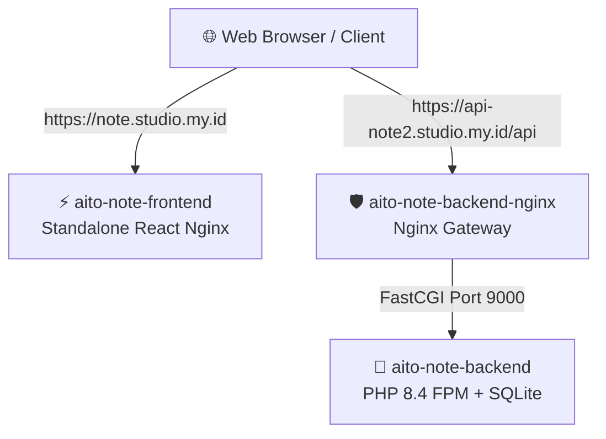

# 🐳 Panduan Docker & Deploy Aito-Note (Terpisah)

Dokumentasi ini menjelaskan arsitektur baru yang **terpisah (decoupled)** antara **Frontend (React/Vite)** dan **Backend (Laravel API)**. Pemisahan ini merupakan praktik terbaik (best practice) yang membuat deployment Anda di Coolify jauh lebih cepat, ringan, dan bebas dari konflik port VPS!

---

## 🏗️ Arsitektur Baru (Production/VPS)

Di server VPS (Coolify), aplikasi Anda dideploy secara independen menjadi dua resource terpisah:



### 1. Backend Stack (Docker Compose di Coolify)
* Dideploy menggunakan resource **Docker Compose** di Coolify.
* Hanya menjalankan kontainer backend (`backend` + `backend-nginx`).
* **Bebas Konflik Port:** Kita tidak perlu me-map port kontainer ke host VPS lagi! Coolify merutekan domain `api-note2.studio.my.id` secara internal ke port `80` pada container `backend-nginx`.

### 2. Frontend App (Standalone Application di Coolify)
* Dideploy sebagai **Standalone Application** di Coolify dari sub-folder `/frontend`.
* Menghubungi API melalui variabel `VITE_API_URL` yang disetel ke `https://api-note2.studio.my.id/api`.

---

## 🛠️ Langkah-Langkah Deploy di Coolify

Ikuti langkah mudah berikut untuk mendeploy kedua bagian ini:

### Langkah A: Deploy Backend (Laravel API)

1. **Buat Resource Baru di Coolify:**
   * Pilih **New Resource** -> **Docker Compose**.
   * Hubungkan ke repositori GitHub Anda (`nrahmatk/aito-note`).
   * Gunakan branch **`main`**.
2. **Konfigurasi Domain & Build:**
   * **Domain untuk backend-nginx:** Masukkan `https://api-note2.studio.my.id`.
   * **Base Directory:** `/`
   * **Docker Compose Location:** `/docker-compose.yml`
3. **Environment Variables:**
   * Di tab **Environment Variables**, tambahkan:
     * `APP_BACKEND_PORT=8008` (hanya untuk lokal/VPS jika Anda masih ingin membuka port mentahnya).
4. **Deploy:**
   * Klik **Redeploy / Deploy**. Setelah statusnya **`Success/Finished`**, API Anda siap diakses!

---

### Langkah B: Deploy Frontend (React SPA)

1. **Buat Resource Baru di Coolify:**
   * Pilih **New Resource** -> **Public Repository / Private Repository** (pilih Standalone Application).
   * Hubungkan ke repositori GitHub Anda (`nrahmatk/aito-note`), branch **`main`**.
2. **Konfigurasi Build & Direktori:**
   * **Domain untuk frontend:** Masukkan `https://note.studio.my.id`.
   * **Base Directory:** `/frontend` *(Sangat penting! Ini memberi tahu Coolify untuk fokus hanya pada folder frontend)*.
   * **Dockerfile Path:** `Dockerfile` *(Coolify akan otomatis menggunakan `frontend/Dockerfile`)*.
3. **Environment Variables:**
   * Di tab **Environment Variables**, tambahkan:
     * `VITE_API_URL=https://api-note2.studio.my.id/api` *(Ini memberi tahu React ke mana harus memanggil API)*.
4. **Deploy:**
   * Klik **Deploy**. Setelah statusnya hijau, web Anda sudah online dan terhubung penuh ke backend API!

---

## 💻 Cara Menjalankan Secara Lokal (Local Development)

Untuk menjalankan di komputer lokal Anda, arsitektur terpisah ini sangat nyaman dan cepat:

### 1. Jalankan Backend (Docker)
Buka terminal di direktori utama `notes/` dan jalankan:
```bash
docker compose up --build -d
```
API Anda akan langsung aktif di **`http://localhost:8000/api`**.

### 2. Jalankan Frontend (Lokal dengan pnpm)
Buka terminal baru di direktori `notes/frontend/` dan jalankan:
```bash
pnpm install
pnpm dev
```
Website frontend Anda akan aktif secara instant di **`http://localhost:5173`** (atau port default Vite Anda) dan akan langsung terhubung secara dinamis ke backend API lokal Anda di port `8000`.

---

## ⚠️ Tips & Troubleshooting

> [!TIP]  
> **Database SQLite Lokal & VPS:**  
> Di lokal Anda, data SQLite tersimpan di file `./backend/database/database.sqlite` dan bersifat persisten. Di VPS, Coolify akan menggunakan volume persistence untuk menjaga data Anda tetap aman saat update.

> [!IMPORTANT]  
> **Enkripsi Cloudflare:**  
> Pastikan di panel **Cloudflare -> SSL/TLS** Anda memilih enkripsi **Full** atau **Full (Strict)** agar sertifikat Let's Encrypt bawaan dari Coolify dan Cloudflare dapat bersinkronisasi secara aman tanpa mengalami masalah redirect loop.
