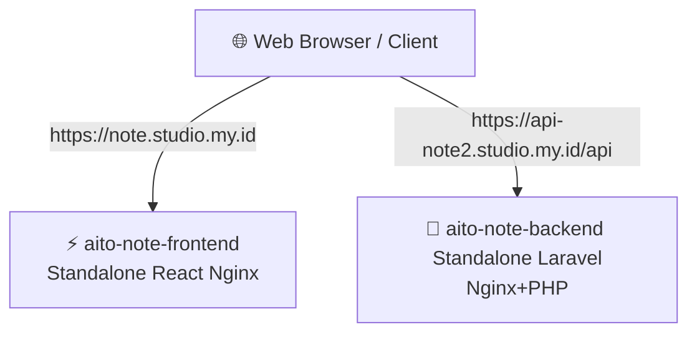

# 🐳 Panduan Docker & Deploy Aito-Note (100% Standalone)

Dokumentasi ini menjelaskan arsitektur baru yang **100% mandiri (standalone)**. Sekarang, Frontend dan Backend masing-masing berjalan dalam **satu kontainer tunggal** (1 Dockerfile). 

Kita **TIDAK lagi memerlukan `docker-compose.yml`**! Ini adalah arsitektur paling bersih, ringan, dan termudah untuk dideploy di Coolify maupun dijalankan secara lokal.

---

## 🏗️ Arsitektur Standalone (Production/VPS)

Di server VPS (Coolify), kedua aplikasi berjalan secara terpisah dan di-proxy langsung ke domain masing-masing:



### 1. Backend (Laravel API ── 1 Container)
* Menggunakan image **`webdevops/php-nginx:8.4-alpine`** yang menggabungkan Nginx + PHP 8.4 FPM dalam satu kontainer ultra-cepat.
* Merespon request langsung dari domain `api-note2.studio.my.id` pada port `80` internal.

### 2. Frontend (React SPA ── 1 Container)
* Berjalan mandiri menggunakan Nginx Alpine untuk menyajikan build statis.
* Merespon request dari domain `note.studio.my.id` pada port `80` internal.

---

## 🛠️ Langkah-Langkah Deploy di Coolify

Anda kini cukup membuat **2 Standalone Application** di Coolify:

### 🐘 Langkah A: Deploy Backend (Laravel API)

1. **Buat Aplikasi Baru:**
   * Di Coolify, klik **New Resource** -> **Public/Private Repository** (pilih Standalone Application).
   * Hubungkan ke repositori GitHub Anda (`nrahmatk/aito-note`), branch **`main`**.
2. **Konfigurasi Domain & Direktori:**
   * **Domain:** Masukkan `https://api-note2.studio.my.id`.
   * **Base Directory:** `/backend` *(Sangat penting! Memberitahu Coolify untuk fokus ke folder `/backend`)*.
   * **Dockerfile Path:** `Dockerfile` *(Coolify akan membaca `/backend/Dockerfile`)*.
3. **Environment Variables:**
   * Di tab **Environment Variables**, masukkan semua variabel `.env` Laravel Anda (seperti `APP_KEY`, `APP_ENV=production`, dll.).
   * *(Database SQLite `database/database.sqlite` akan otomatis dibuat dan aktif).*
4. **Deploy:**
   * Klik **Deploy**! Backend API Anda langsung aktif dan online.

---

### ⚡ Langkah B: Deploy Frontend (React SPA)

1. **Buat Aplikasi Baru:**
   * Klik **New Resource** -> **Public/Private Repository** (pilih Standalone Application).
   * Hubungkan ke repositori GitHub Anda (`nrahmatk/aito-note`), branch **`main`**.
2. **Konfigurasi Domain & Direktori:**
   * **Domain:** Masukkan `https://note.studio.my.id`.
   * **Base Directory:** `/frontend` *(Sangat penting! Memberitahu Coolify untuk fokus ke folder `/frontend`)*.
   * **Dockerfile Path:** `Dockerfile` *(Coolify akan membaca `/frontend/Dockerfile`)*.
3. **Environment Variables:**
   * Di tab **Environment Variables**, tambahkan:
     * **Key:** `VITE_API_URL`
     * **Value:** `https://api-note2.studio.my.id/api`
4. **Deploy:**
   * Klik **Deploy**! Web Frontend Anda langsung online dan terhubung sempurna ke Backend API.

---

## 💻 Cara Menjalankan Secara Lokal (Local Development)

Untuk menjalankan di komputer lokal Anda, jalankan masing-masing secara terpisah:

### 1. Jalankan Backend (Docker Standalone)
Buka terminal di folder `backend/` dan jalankan:
```bash
# Build image backend
docker build -t aito-backend .

# Jalankan container di port 8000
docker run -d -p 8000:80 --name aito-backend aito-backend
```
API Anda aktif di **`http://localhost:8000/api`**.

### 2. Jalankan Frontend (Lokal via Vite)
Buka terminal baru di folder `frontend/` dan jalankan:
```bash
pnpm install
pnpm dev
```
Website frontend aktif secara instan di **`http://localhost:5173`** (atau port default Vite Anda) dan langsung terhubung secara dinamis ke backend API lokal.
