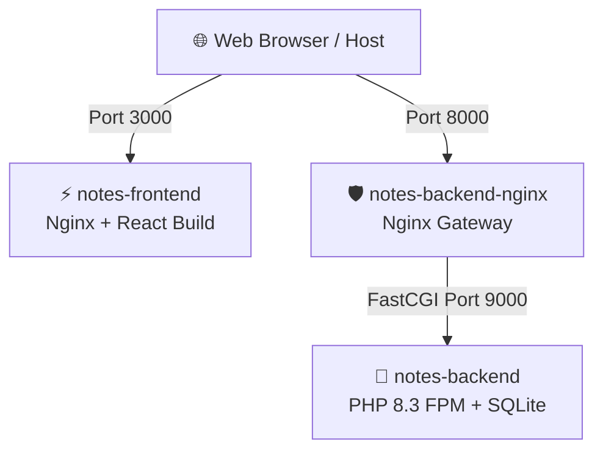

# 🐳 Panduan Docker untuk Running Aito-Note

Dokumentasi ini menjelaskan arsitektur Docker yang telah dibuat untuk menjalankan aplikasi **Aito-Note** (Backend Laravel & Frontend React/Vite) secara containerized, lengkap dengan perintah-perintah yang Anda perlukan.

---

## 🏗️ Arsitektur Container

Aplikasi ini dibagi menjadi 3 container utama yang berjalan di dalam satu network internal (`notes-network`):



1. **`aito-note-frontend` (Port `3000`):**
   - React + Vite SPA yang sudah dibundel untuk production dan disajikan secara efisien menggunakan **Nginx Alpine**.
   - Dilengkapi konfigurasi SPA routing (agar tidak 404 saat halaman di-refresh di URL seperti `/login` atau `/notes`).
   - Secara otomatis terhubung ke backend API di `http://localhost:8000/api` menggunakan variabel build `VITE_API_URL`.

2. **`aito-note-backend-nginx` (Port `8000`):**
   - Nginx server tipis yang bertindak sebagai gateway di depan Laravel backend.
   - Menangani file static dan mem-proxy request dinamis `.php` ke service PHP-FPM backend.

3. **`aito-note-backend` (Internal Port `9000`):**
   - **PHP 8.3-FPM (Alpine)** yang dikonfigurasi dengan semua ekstensi Laravel yang diperlukan (`pdo_sqlite`, `bcmath`, `gd`, `zip`, dll.).
   - Database SQLite di-mount ke host (`./backend/database`), sehingga data note yang sudah ada **tetap aman, persisten, dan sinkron** dengan environment lokal Anda.

---

## 🛠️ File-File Docker yang Dibuat

1. **[`docker-compose.yml`](file:///d:/project/ADW/Belajar/notes/docker-compose.yml)**: Orkestrasi seluruh container, port forwarding, database volume, dan variabel environment.
2. **[`backend/Dockerfile`](file:///d:/project/ADW/Belajar/notes/backend/Dockerfile)**: Dockerfile PHP 8.3-FPM dengan SQLite dan Composer caching optimal.
3. **[`backend/docker/nginx/default.conf`](file:///d:/project/ADW/Belajar/notes/backend/docker/nginx/default.conf)**: Konfigurasi Nginx proxy ke container PHP-FPM.
4. **[`frontend/Dockerfile`](file:///d:/project/ADW/Belajar/notes/frontend/Dockerfile)**: Multi-stage Dockerfile untuk build React (Node.js) & serve dengan Nginx.
5. **[`frontend/docker/nginx.conf`](file:///d:/project/ADW/Belajar/notes/frontend/docker/nginx.conf)**: Konfigurasi Nginx untuk frontend SPA router support.
6. **[`.dockerignore` Backend](file:///d:/project/ADW/Belajar/notes/backend/.dockerignore)** & **[`.dockerignore` Frontend](file:///d:/project/ADW/Belajar/notes/frontend/.dockerignore)**: Mempercepat build dengan memisahkan `node_modules`, `vendor`, `.git`, dll.

---

## 🚀 Cara Menjalankan Aplikasi

> [!NOTE]  
> Pastikan aplikasi Docker Desktop di Windows Anda sudah aktif sebelum menjalankan perintah-perintah di bawah.

### 1. Build dan Jalankan Container (Pertama Kali / Rebuild)
Buka terminal (PowerShell/Command Prompt) di direktori root `notes/`, lalu jalankan:
```bash
docker compose up --build -d
```
*Flag `-d` (detached mode) akan menjalankan container di background sehingga terminal Anda tetap bebas digunakan.*

### 2. Memeriksa Status Container
Gunakan perintah berikut untuk memastikan semua container berjalan dengan status `Up`:
```bash
docker compose ps
```

### 3. Memantau Log Realtime
Jika Anda ingin melihat aktivitas log dari seluruh container (misalnya error PHP atau request Nginx):
```bash
docker compose logs -f
```

### 4. Menghentikan Container
Untuk mematikan seluruh container tanpa menghapus data database:
```bash
docker compose down
```

---

## 🌐 Akses Aplikasi

Setelah container berhasil berjalan (`Up`), Anda dapat langsung membuka browser:
* **Frontend Web App:** 👉 [http://localhost:3000](http://localhost:3000)
* **Backend API (Laravel Health/JSON):** 👉 [http://localhost:8000/api](http://localhost:8000/api)

---

## ⚠️ Tips & Troubleshooting

> [!TIP]  
> **Database Persistence:**  
> SQLite database Anda tersimpan di file `./backend/database/database.sqlite` di komputer lokal Anda. Setiap kali Anda menambah/mengubah data di dalam container, file lokal di host akan ikut ter-update, sehingga data Anda tidak akan hilang saat container dihancurkan (`docker compose down`).

> [!WARNING]  
> **Masalah Port Konflik:**  
> Pastikan tidak ada aplikasi lokal lain (seperti `php artisan serve` lokal Anda yang sedang berjalan di port `8000` atau program lain di port `3000`).  
> *Sebelum menjalankan docker, matikan service lokal yang sedang berjalan di terminal Anda.*

> [!IMPORTANT]  
> **Menjalankan Perintah Artisan di Dalam Container:**  
> Jika Anda perlu menjalankan perintah Laravel (misal migrate baru, seeder, atau tinker) di dalam container backend, gunakan `docker compose exec`:
> - **Migrate Ulang / Fresh:**  
>   `docker compose exec backend php artisan migrate:fresh --seed`
> - **Masuk ke Laravel Tinker:**  
>   `docker compose exec backend php artisan tinker`
> - **Clear Cache Laravel:**  
>   `docker compose exec backend php artisan optimize:clear`
